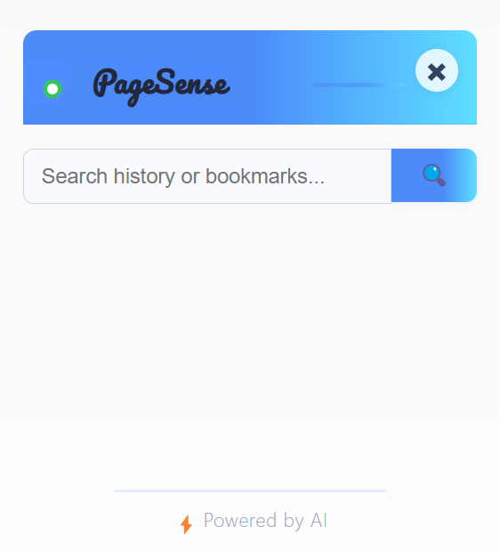
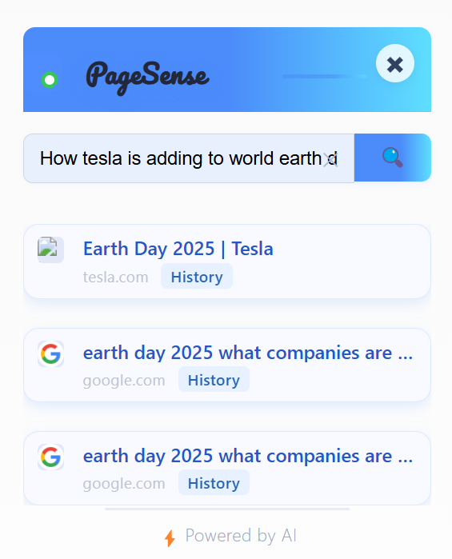

<div align="center">
  
  <h1>PageSense</h1>
  <p><b>🔍 Intelligent search for your Chrome history & bookmarks, powered by AI.</b></p>
</div>

---

## 📸 Screenshots & Demo

> See PageSense in action!

<p align="center">
  
  
</p>
<p align="center">
  <i>Extension Popup UI &nbsp;&nbsp;&nbsp;&nbsp;&nbsp;&nbsp;&nbsp;&nbsp; Sample search query and results</i>
</p>

<p align="center">
  <a href="static/DEMO.mp4">▶️ Watch the demo video (MP4)</a>
</p>

---

## ✨ Features

- 🧠 <b>Semantic Search</b>: Find what you remember, not just what you typed
- 📚 <b>Unified Results</b>: Searches both history and bookmarks
- ⚡ <b>Instant Popup</b>: Clean, fast UI with animated results
- 🛡️ <b>Privacy-First</b>: Runs locally, no cloud required
- 🎨 <b>Customizable Icon</b>: Modern, colorful branding

---

## 🚀 Quick Start

1. <b>Clone the repository</b>
   ```sh
   git clone https://github.com/SID-SURANGE/AI-Sandbox.git
   cd AI-Sandbox/source_codes/pageSense/extension
   ```
2. <b>Load the extension in Chrome</b>
   - Open <kbd>chrome://extensions</kbd>
   - Enable <b>Developer mode</b> (top right)
   - Click <b>Load unpacked</b> and select this <code>extension/</code> folder
   - <b>Tip:</b> You should see the colorful PageSense icon in your toolbar!
3. <b>Run the backend service</b>
   - See [backend README](../backend/README.md) or run:
     ```sh
     cd ../backend
     docker-compose up --build
     # or
     pip install -r requirements.txt
     uvicorn app.main:app --reload --host 0.0.0.0 --port 8000
     ```

---

## 🛠️ Requirements

- Google Chrome (v88+)
- Backend API at <code>http://localhost:8000</code>
- <i>Optional:</i> Inkscape for icon generation

---

## 🖼️ Icon Management

Want to update the extension icon?

```sh
inkscape icon.svg --export-type=png --export-filename=icon16.png -w 16 -h 16
inkscape icon.svg --export-type=png --export-filename=icon48.png -w 48 -h 48
inkscape icon.svg --export-type=png --export-filename=icon128.png -w 128 -h 128
```

---

## 💡 Usage

1. Click the  PageSense icon in your Chrome toolbar
2. Type your search (e.g., <i>"python async bookmarks"</i>)
3. View results from your history and bookmarks, ranked by relevance

---

## 🧑‍💻 Development Structure

- <b>popup.html / popup.css / popup.js</b> — UI for the popup
- <b>background.js</b> — Service worker for indexing and messaging
- <b>manifest.json</b> — Chrome extension manifest (v3)
- <b>icon.svg/png</b> — Source and exported icons

---

## ⚠️ Troubleshooting & Tips

> **Extension icon missing?**
> - Make sure you have the latest <code>icon16.png</code>, <code>icon48.png</code>, and <code>icon128.png</code> in the extension folder
> - Reload the extension in <kbd>chrome://extensions</kbd>
> - Remove and re-add if the icon cache is stuck

> **Backend not reachable?**
> - Confirm your backend is running at <code>http://localhost:8000</code>
> - Check the browser console for errors

> **Permission issues?**
> - Ensure <code>history</code> and <code>bookmarks</code> permissions are enabled in <b>manifest.json</b>

---

## 🧩 How It Works

PageSense consists of a Chrome extension (this repo) and a backend service that powers the semantic search. The backend uses **Qdrant** as a high-performance vector database to store and search embeddings for your history and bookmarks. This enables lightning-fast, AI-powered search right on your machine.

- 🔗 [Qdrant Documentation](https://qdrant.tech/documentation/)
- Embeddings are generated and indexed locally for privacy and speed.

### 🗂️ How and When is the Qdrant Database Updated?

- **Initial Indexing:**
  - When you first install and run PageSense, all your existing Chrome history and bookmarks are indexed and stored as embeddings in the Qdrant database.

- **Daily Automatic Updates:**
  - PageSense runs a background task every 24 hours to check for new history items and bookmarks.
  - Any new or changed items are embedded and added to Qdrant, keeping your search results fresh.

- **Manual or On-Demand Updates:**
  - If you reinstall or reset the extension, a full reindex will be triggered.
  - You can also trigger a reindex by restarting the backend service.

- **Privacy:**
  - All data and embeddings remain on your device—nothing is sent to the cloud.

---

> 🛠️ **Found a bug or have a suggestion?**
> Please [open an issue](../../issues) or submit a PR—your feedback helps make PageSense more stable and reliable!

---

<div align="center">
  <sub>Made with ❤️ by the PageSense Team</sub>
</div>
